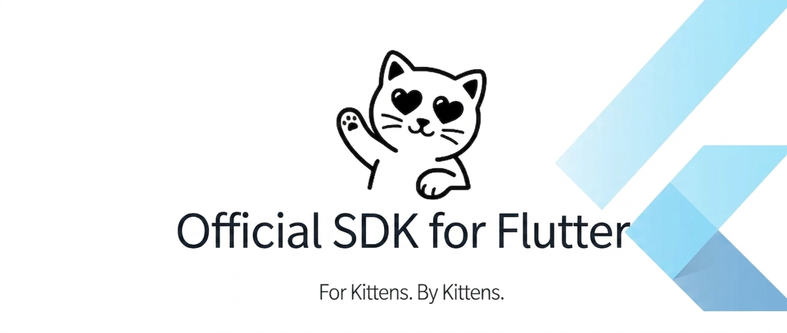
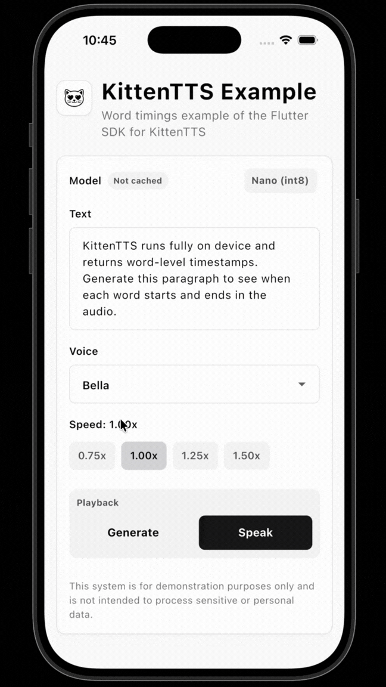
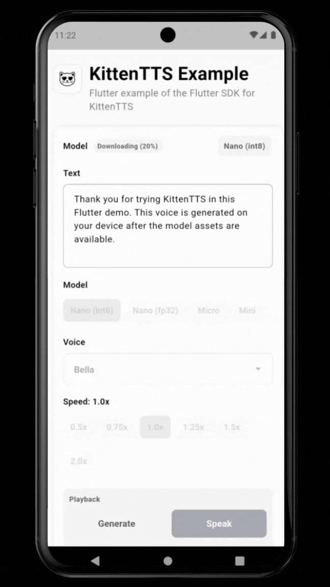
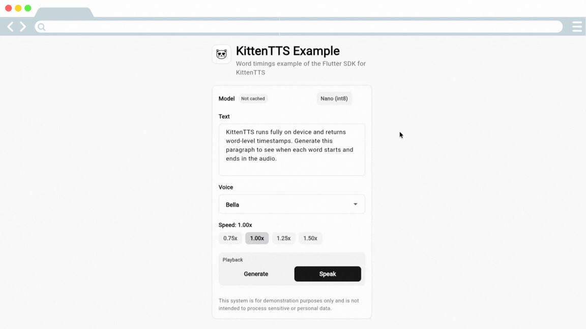

# KittenTTS Flutter

<p align="center">
  
</p>

<p align="center">
  On-device text-to-speech for Flutter.
  <br />
  Generate speech on Android, iOS, macOS, Linux, and Windows without sending text to a cloud TTS API.
</p>

<p align="center">
  <a href="https://huggingface.co/spaces/KittenML/KittenTTS-Demo"></a>
  <a href="https://discord.com/invite/VJ86W4SURW"></a>
  <a href="https://kittenml.com"></a>
  <a href="https://github.com/KittenML/KittenTTS-flutter"></a>
  <a href="LICENSE"></a>
  
</p>

## See It In Action

<p align="center">
  
  
</p>

<p align="center">
  
</p>

<p align="center">
  <strong>iOS</strong> · Basic example &nbsp;&nbsp;&nbsp; <strong>Android</strong> · Basic example &nbsp;&nbsp;&nbsp; <strong>Web</strong> · Browser example
</p>

## What Is KittenTTS Flutter?

KittenTTS Flutter lets you add local speech synthesis to a Flutter app:

- **Text-to-speech** - neural voice synthesis from plain text.
- **On-device inference** - powered by KittenTTS and ONNX Runtime.
- **Private by default** - no cloud TTS request after assets are available.
- **Offline-ready** - download once into the app cache, or point the SDK at
  local model files.
- **App-friendly output** - play audio directly, save WAV data, or use generated
  word timings for read-aloud UI.

No cloud. No API key. No text leaving the device for speech generation.

---

The SDK sends anonymous generation analytics; see [Getting started](doc/getting-started.md#analytics) for details and opt-out.

## SDK

| Runtime | Status | Docs |
| --- | --- | --- |
| Flutter Android | Developer preview | [Getting started](doc/getting-started.md) |
| Flutter iOS | Developer preview | [Getting started](doc/getting-started.md) |
| Flutter macOS | Developer preview | [Getting started](doc/getting-started.md) |
| Flutter Linux | Developer preview | [Getting started](doc/getting-started.md) |
| Flutter Windows | Developer preview | [Getting started](doc/getting-started.md) |

Install:

```bash
flutter pub add kittentts
```

---

## Quick Start

Install the SDK:

```bash
flutter pub add kittentts
```

Generate audio in memory:

```dart
import 'package:kittentts/kittentts.dart';

final tts = await KittenTTS.create(
  onProgress: (progress, info) {
    print('setup ${(progress * 100).round()}%');
  },
);

final result = await tts.generate('Hello from KittenTTS on Flutter.');

print(result.duration);
print(result.wavBase64());

await tts.dispose();
```

Play audio through your app's audio layer:

```dart
final tts = await KittenTTS.create(player: myAudioPlayer);

await tts.speak('This voice is generated on the device.');
```

Implement `AudioPlayer` with the package your app already uses, such as
`audioplayers`, `just_audio`, or a native audio bridge.

[Full getting started guide →](doc/getting-started.md)

---

## Sample Apps

- [`examples/basic`](examples/basic) - basic model, voice, speed, Generate, Speak, and Queue demo controls.
- [`examples/word_timings`](examples/word_timings) - word highlighting with generated timings.

---

## Features

- [On-device TTS inference](doc/getting-started.md) on Android, iOS, macOS, Linux, and Windows.
- [Model download and cache](doc/reference/api.md#cache-methods) with progress callbacks.
- [Local/offline model files](doc/guides/offline-assets.md) for apps that cannot depend on a first-run download.
- CE phonemizer through Dart FFI on native platforms.
- [Playback interface](doc/guides/playback.md) for app-provided audio players.
- FIFO playback queue for serializing generated clips.
- WAV output as raw PCM samples, bytes, or base64.
- MP3 helpers are not bundled until a small non-GPL Flutter encoder is available.
- [Word timings](doc/guides/word-timings.md) for read-aloud highlighting.
- [Streaming generation](doc/reference/api.md#ttsstreamtext--voice-speed-) for longer text.

---

## Supported Models

Start with `nano-int8` for the smallest download. Use larger models when quality
matters more than size.

| Model | ID | Parameters | Approx download | Use case |
| --- | --- | --- | --- | --- |
| Nano int8 | `"nano-int8"` | 15M | 25 MB | Smallest app/download size |
| Nano fp32 | `"nano"` | 15M | 56 MB | Nano quality without quantization |
| Micro | `"micro"` | 40M | 41 MB | Better quality, still compact |
| Mini | `"mini"` | 80M | 80 MB | Highest quality option |

[Models and voices →](doc/reference/models.md)

## Voices

```text
Bella, Jasper, Luna, Bruno, Rosie, Hugo, Kiki, Leo
```

```dart
await tts.speak('Luna speaking.', voice: 'luna');
await tts.speak('Slower Bruno speaking.', voice: 'bruno', speed: 0.85);
```

---

## Docs

- [Docs overview](doc/README.md)
- [Getting started](doc/getting-started.md)
- [Playback](doc/guides/playback.md)
- [Local/offline assets](doc/guides/offline-assets.md)
- [Word timings](doc/guides/word-timings.md)
- [Models and voices](doc/reference/models.md)
- [API reference](doc/reference/api.md)
- [Troubleshooting](doc/troubleshooting.md)

Tutorials:

- Tutorials are not written yet for the Flutter SDK.

---

## System Requirements

- Flutter `>= 3.22`
- Dart `>= 3.4`
- iOS `16+`
- macOS `14+`
- Android API `21+`
- Linux and Windows native build toolchains for desktop targets
Runtime dependencies installed by the SDK:

- `flutter_onnxruntime`
- `path_provider`
- `http`
- `archive`
- `ffi`

Audio playback is optional. Use an app-side audio package such as
`audioplayers`, `just_audio`, or your own native audio layer.

---

## Roadmap

- Add first-party playback adapters for common Flutter audio packages.
- Add more streaming playback examples.
- Add more reader-app helpers around pause, resume, and seek state.
- Support future KittenTTS model releases as they become available.

Need something specific? [Open an issue](https://github.com/KittenML/KittenTTS-flutter/issues).

---

## Community And Support

- Website: [kittenml.com](https://kittenml.com/)
- Repository: [KittenML/KittenTTS-flutter](https://github.com/KittenML/KittenTTS-flutter)
- Discord: [Join the community](https://discord.com/invite/VJ86W4SURW)
- Demo: [Hugging Face Spaces](https://huggingface.co/spaces/KittenML/KittenTTS-Demo)
- Issues: [GitHub Issues](https://github.com/KittenML/KittenTTS-flutter/issues)

## Commercial Support

Commercial support is available for teams integrating KittenTTS into their
products, including integration assistance, custom voice development, and
enterprise licensing.

[Contact us](https://docs.google.com/forms/d/e/1FAIpQLSc49erSr7jmh3H2yeqH4oZyRRuXm0ROuQdOgWguTzx6SMdUnQ/viewform?usp=preview)
or email info@stellonlabs.com to discuss your requirements.

## License

Apache 2.0. See [LICENSE](./LICENSE).

## Disclaimers

KittenTTS Flutter is a developer preview and APIs may change between releases.
Generated speech quality, pronunciation, timing metadata, and playback behavior
can vary by model, platform, device, and audio backend. Review generated audio
before using it in production workflows.

The SDK runs speech generation locally after assets are available. Anonymous
generation analytics are enabled by default and can be disabled with
`analytics: false`.
